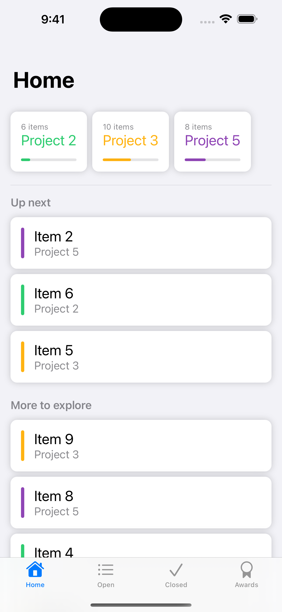
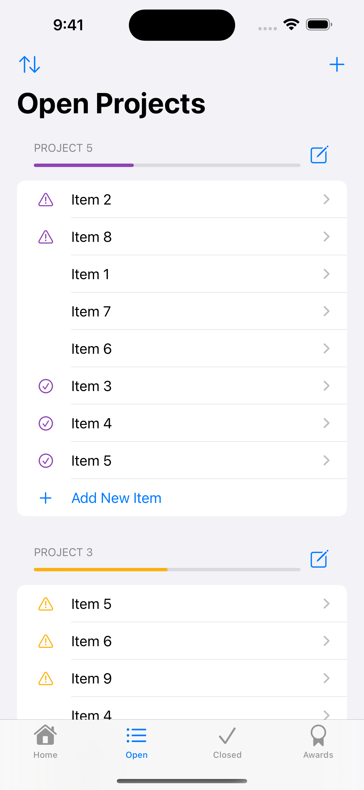
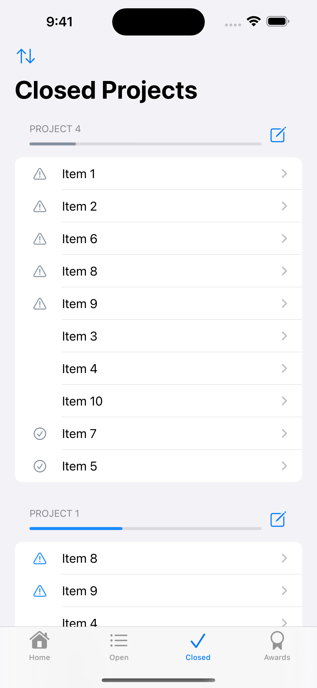
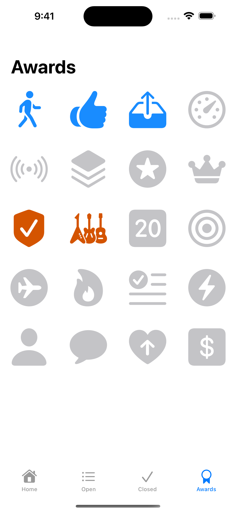
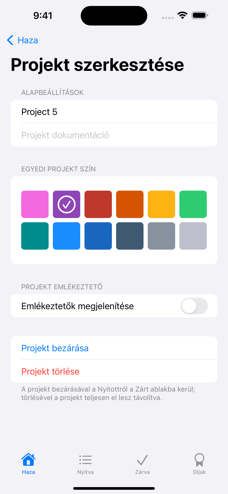
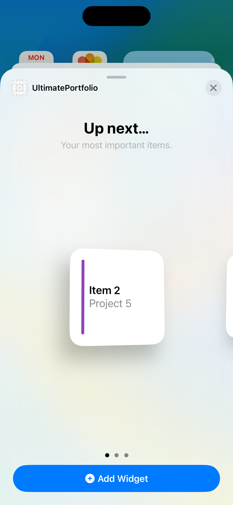
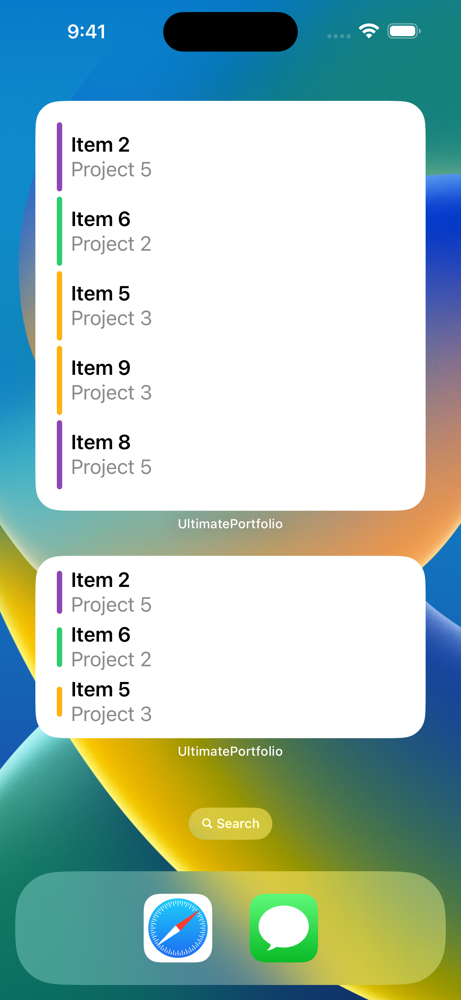

# Achieve!

Achieve!* is an iOS application written entirely in **Swift**.

It’s designed to help you to reach your goals by enabling you to keep track of your progress every step of the way.
 
Create projects, add items and earn awards as you complete them.

   

Achieve! makes use of the **SwiftUI** framework, incorporating **Core Data** and **CloudKit** for data persistence.
 
**Accessibility** is at the core of Achieve!, with fully tested support for **VoiceControl**.
 
The application fully supports **Dark Mode** and also includes **Internationalization** and **Localization** into Hungarian.

 

Other features I’ve implemented include: **Haptic Feedback, Spotlight, Notifications, In-App Purchases, Home Screen Quick Actions, Shortcuts and Widgets.**

   

While developing Achieve!, I learnt much about **Unit Testing**, **UI Testing** and linting my code with **SwiftLint**.
 
These tests ensure that the application continues to function correctly now and long into the future.

Achieve! takes a pragmatic approach to the **MVVM** design pattern, incorporating it into the project where it is practical and makes sense.

*Achieve! began as I followed along with Paul Hudson’s Ultimate Portfolio course available on Hacking with Swift+.
 
Since then, it has developed into the application it is today, influenced by my own ideas, learnings and style.
